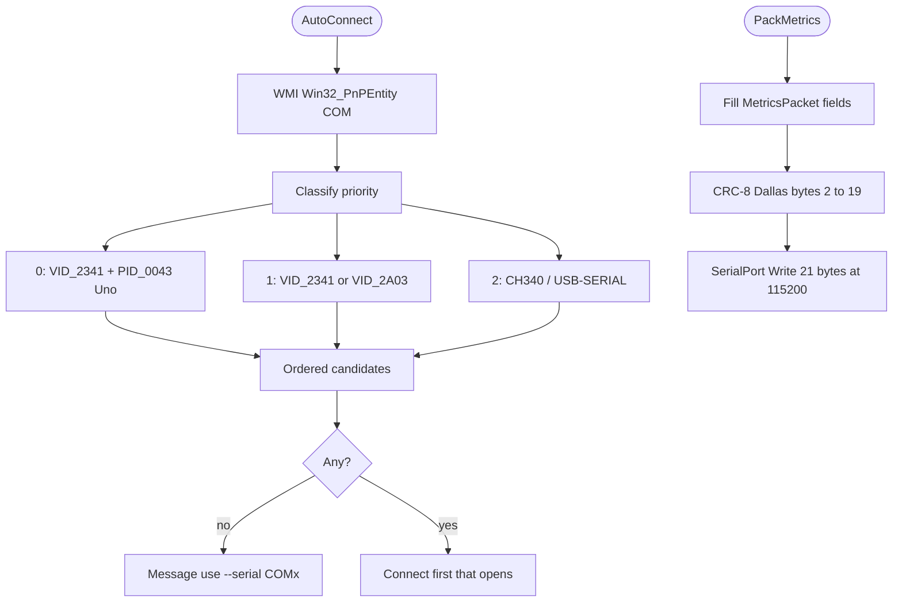

# Flow: ArduinoSerialBridge

WMI port filter, CRC-8 Dallas pack, 115200 serial write.

```mermaid
flowchart TD
  auto([AutoConnect]) --> wmi[WMI Win32_PnPEntity COM]
  wmi --> classify[Classify priority]
  classify --> p0[0: VID_2341 + PID_0043 Uno]
  classify --> p1[1: VID_2341 or VID_2A03]
  classify --> p2[2: CH340 / USB-SERIAL]
  p0 --> candidates[Ordered candidates]
  p1 --> candidates
  p2 --> candidates
  candidates --> empty{Any?}
  empty -->|no| fail[Message use --serial COMx]
  empty -->|yes| tryOpen[Connect first that opens]

  pack([PackMetrics]) --> fill[Fill MetricsPacket fields]
  fill --> crc[CRC-8 Dallas bytes 2 to 19]
  crc --> write[SerialPort Write 21 bytes at 115200]
```

Source: [`src/desktop/ArduinoSerialBridge.cs`](../../../src/desktop/ArduinoSerialBridge.cs)
