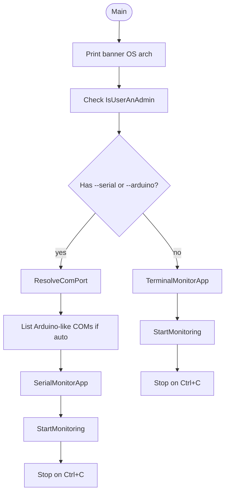

# Flow: Program.cs

CLI entry point — privilege banner, mode selection, graceful Ctrl+C.

```mermaid
flowchart TD
  start([Main]) --> banner[Print banner OS arch]
  banner --> admin[Check IsUserAnAdmin]
  admin --> parseArgs{Has --serial or --arduino?}
  parseArgs -->|no| terminal[TerminalMonitorApp]
  parseArgs -->|yes| resolve[ResolveComPort]
  resolve --> listPorts[List Arduino-like COMs if auto]
  listPorts --> serial[SerialMonitorApp]
  terminal --> loopT[StartMonitoring]
  serial --> loopS[StartMonitoring]
  loopT --> stopT[Stop on Ctrl+C]
  loopS --> stopS[Stop on Ctrl+C]
```

Source: [`src/desktop/Program.cs`](../../../src/desktop/Program.cs)
