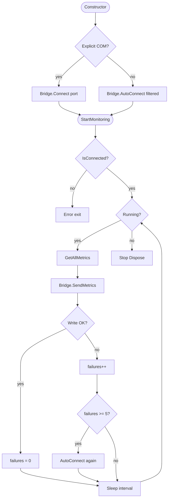

# Flow: SerialMonitorApp

Stream metrics to Arduino; reconnect after consecutive failures.

```mermaid
flowchart TD
  ctor([Constructor]) --> connect{Explicit COM?}
  connect -->|yes| open[Bridge.Connect port]
  connect -->|no| auto[Bridge.AutoConnect filtered]
  open --> start([StartMonitoring])
  auto --> start
  start --> check{IsConnected?}
  check -->|no| exit[Error exit]
  check -->|yes| loop{Running?}
  loop -->|yes| metrics[GetAllMetrics]
  metrics --> send[Bridge.SendMetrics]
  send --> ok{Write OK?}
  ok -->|yes| resetFail[failures = 0]
  ok -->|no| incFail[failures++]
  incFail --> many{failures >= 5?}
  many -->|yes| reconnect[AutoConnect again]
  many -->|no| sleep
  resetFail --> sleep[Sleep interval]
  reconnect --> sleep
  sleep --> loop
  loop -->|no| stop[Stop Dispose]
```

Source: [`src/desktop/SerialMonitorApp.cs`](../../../src/desktop/SerialMonitorApp.cs)
