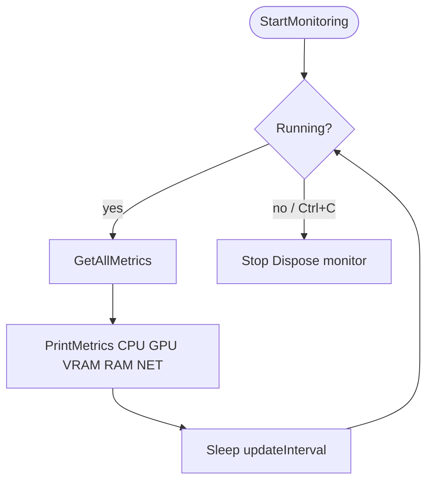

# Flow: TerminalMonitorApp

Console loop at ~1 Hz.

```mermaid
flowchart TD
  start([StartMonitoring]) --> loop{Running?}
  loop -->|yes| metrics[GetAllMetrics]
  metrics --> print[PrintMetrics CPU GPU VRAM RAM NET]
  print --> sleep[Sleep updateInterval]
  sleep --> loop
  loop -->|no / Ctrl+C| stop[Stop Dispose monitor]
```

Source: [`src/desktop/TerminalMonitorApp.cs`](../../../src/desktop/TerminalMonitorApp.cs)
