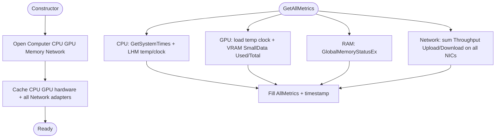

# Flow: WindowsNativeMonitor

Sensor acquisition — P/Invoke + LibreHardwareMonitor.

```mermaid
flowchart TD
  ctor([Constructor]) --> openLhm[Open Computer CPU GPU Memory Network]
  openLhm --> findHw[Cache CPU GPU hardware + all Network adapters]
  findHw --> ready([Ready])

  getAll([GetAllMetrics]) --> cpu[CPU: GetSystemTimes + LHM temp/clock]
  getAll --> gpu[GPU: load temp clock + VRAM SmallData Used/Total]
  getAll --> ram[RAM: GlobalMemoryStatusEx]
  getAll --> net[Network: sum Throughput Upload/Download on all NICs]
  cpu --> pack[Fill AllMetrics + timestamp]
  gpu --> pack
  ram --> pack
  net --> pack
```

Source: [`src/desktop/WindowsNativeMonitor.cs`](../../../src/desktop/WindowsNativeMonitor.cs)
